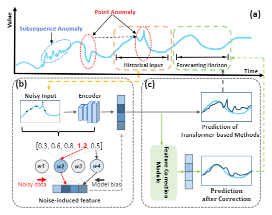
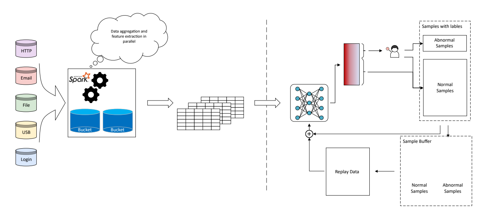

Hi! I'm an undergraduate student at [Sichuan University(SCU)](https://www.scu.edu.cn/), majoring in Computer Science & technology (Top-notch Program, a class of 15 elite students selected from 400+) . 

Currently, I am an undergraduate researcher assistant at [Institute of Network and Intelligent Systems](https://yj-zhou.github.io/) since Sep, 2022, advised by [Prof. Yinjie Zhou](https://cs.scu.edu.cn/info/1286/15957.htm). 

## Education

### Bachelor: Sichuan University (2021.9 ~ )

- **Major**：Computer Science and Technology, College of Computer Science
- **GPA**：3.88/4.0
- **Average Score**：91.23/100

## Research Interests

- Data Mining (Anomaly Detection, Time Series Forecasting, Recommendation System, etc)
- Representation Learning & Self-Supervised Learning

## Recent Research

### Dc$^2$former: Dual-Constrained and Self-Corrected Transformer for Time Series Forecasting                

_with [Prof. Lu Zhang](https://scholar.google.com/citations?user=u3N8K58AAAAJ&hl=en&oi=sra), Chengdu University of Information Technology and [Prof. Yinjie Zhou](https://cs.scu.edu.cn/info/1286/15957.htm), Sichuan University_                                                                                                                                 

- Our research focused on improving time series forecasting models by addressing the affects posed by noisy data. We introduced a novel learning framework based on feature-level corretion to mitigate the impact of noise and improve the  accuracy of forecasting.
- For representative advanced time transformers, experiemtal results on both metrics showed satisfactory performance, greatly promoting the application of transformer-based models.
- Currently working on a paper that is expected to be submitted to IJCAI2024.

### CERTD: Continuous-Enhanced and Rapid insider Threat Detection                 

_with Di Wu, Sichuan University and [Prof. Yinjie Zhou](https://cs.scu.edu.cn/info/1286/15957.htm), Sichuan Unniversity_

- Our research delved into addressing the challenge of insider threat detection with real-world streaming data. We introduced a machine learning-based detection system that integrates continual learning techniques, ensuring efficient adaptation to evolving data streams and enabling effective real-time threat detection.
- I played a role in conducting extensive literature reviews within the domain of continual learning and reproducing code for baseline models.
  
## Projects
| Course/Competition  | Project Name  | link  |
|---|---|---|
| Massive Data Processing and Intelligent Decision  | Douban Book Classification System Based on Text Classification  |  [Course work](../files/Douban.pdf) |
|  Huawei Mindspore Zhongzhi Competition | Fully Convolutional Networks for Semantic Segmentation  | [Project Site](https://www.mindspore.cn/tutorials/application/zh-CN/master/cv/fcn8s.html) |
|  Principle of Database System | ACM Competition Training Team Assistance System  |  [Project Site](http://scuacm.tankie.top/home/) |

## Award & Scholarships

- 2023  Annual Scholarship of the Programme for Excellant in Basic Disciplines
- 2023  Gold Quality Award in Huawei Mindspore Application Project
- 2023  Second Prize in China Undergraduate Mathematical Contest in Modeling
- Second Prize in Sichuan University Tencent Cup Programming Competition
- First Prize in Lanqiao Cup Programming Competition

## Programming Skills

- Programming Languages: **Python (Pytorch, Tensorflow), C/C++**

- Miscellaneous： **Linux, Vim, PyTorch, Git, Markdown, SQL, $\LaTeX$ etc.**

## Leaderships

- **Vice President** of Artificial Intelligent Association, Sichuan University
